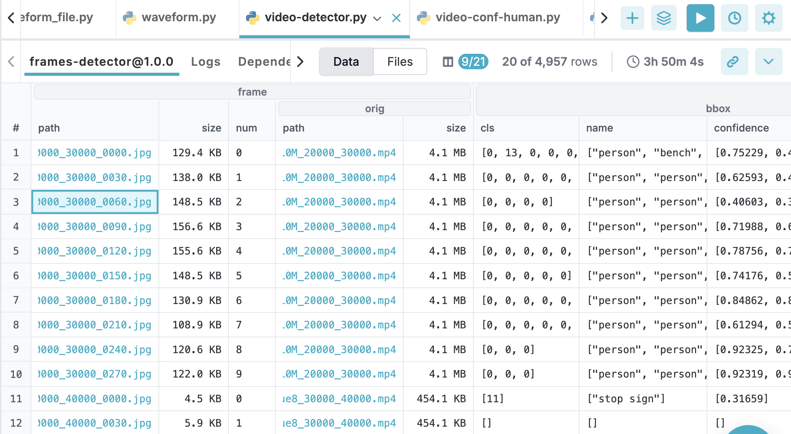

# Audio & Video Examples Tutorial

This tutorial shows how to process and analyze audio/video data at scale with DataChain.

Unlike big data (lots of rows in tables), **heavy data** is large, complex, unstructured
files - videos, audio, images - rich in information but harder to query directly.

DataChain turns heavy data into structured, queryable form for fast analysis and
integration with AI/ML pipelines, dashboards, and LLM reasoning.


📊 Why this matters:
- Turn unstructured heavy data into structured, analyzable form.
- Generate new features and signals for deeper insight.
- Process millions of files at high speed using parallel and distributed compute.

## 1. Extract Frames from Video & Detect Objects

Install dependencies:
```shell
uv pip install -r requirements.txt
```

Run the Frame Extractor:
```shell
python video-detector.py
```
<details>
<summary>video-detector.py script</summary>

```python
# /// script
# dependencies = [
#   "datachain[video,audio]",
#	"opencv-python",
#	"ultralytics",
# ]
# ///

import os
from typing import Iterator

import datachain as dc
from datachain import VideoFile, ImageFile
from datachain.model.ultralytics import YoloBBoxes, YoloSegments, YoloPoses

from pydantic import BaseModel
from ultralytics import YOLO, settings

local = False
bucket = "data-video" if local else "s3://datachain-usw2-main-dev"
input_path = f"{bucket}/balanced_train_segments/video"
output_path = f"{bucket}/temp/video-detector-frames"
detection_dataset = "frames-detector"
target_fps = 1

model_bbox = "yolo11n.pt"
model_segm = "yolo11n-seg.pt"
model_pose = "yolo11n-pose.pt"


# Upload models to avoid YOLO-downloader issues
if not local:
    weights_dir = f"{os.getcwd()}/{settings['weights_dir']}"
    dc.read_storage([
        f"{bucket}/models/{model_bbox}",
        f"{bucket}/models/{model_segm}",
        f"{bucket}/models/{model_pose}",
    ]
    ).to_storage(weights_dir, placement="filename")

    model_bbox = f"{weights_dir}/{model_bbox}"
    model_segm = f"{weights_dir}/{model_segm}"
    model_pose = f"{weights_dir}/{model_pose}"


class YoloDataModel(BaseModel):
    bbox: YoloBBoxes
    segm: YoloSegments
    poses: YoloPoses


class VideoFrameImage(ImageFile):
    num: int
    orig: VideoFile


def extract_frames(file: VideoFile) -> Iterator[VideoFrameImage]:
    info = file.get_info()

    # one frame per sec
    step = int(info.fps / target_fps) if target_fps else 1
    frames = file.get_frames(step=step)

    for num, frame in enumerate(frames):
        image = frame.save(output_path, format="jpg")
        yield VideoFrameImage(**image.model_dump(), num=num, orig=file)


def process_all(yolo: YOLO, yolo_segm: YOLO, yolo_pose: YOLO, frame: ImageFile) -> YoloDataModel:
    img = frame.read()
    return YoloDataModel(
        bbox=YoloBBoxes.from_results(yolo(img, verbose=False)),
        segm=YoloSegments.from_results(yolo_segm(img, verbose=False)),
        poses=YoloPoses.from_results(yolo_pose(img, verbose=False))
    )


def process_bbox(yolo: YOLO, frame: ImageFile) -> YoloBBoxes:
    return YoloBBoxes.from_results(yolo(frame.read(), verbose=False))


chain = (
    dc
    .read_storage(input_path, type="video")
    .filter(dc.C("file.path").glob("*.mp4"))
    .sample(2)
    .settings(parallel=5)

    .gen(frame=extract_frames)

    # Initialize models: once per processing thread
    .setup(
        yolo=lambda: YOLO(model_bbox),
        # yolo_segm=lambda: YOLO(model_segm),
        # yolo_pose=lambda: YOLO(model_pose)
    )

    # Apply yolo detector to frames
    .map(bbox=process_bbox)
    # .map(yolo=process_all)
    .order_by("frame.path", "frame.num")
    .save(detection_dataset)
)

if local:
    chain.show()
```
</details>

Data model Studio UI:



Data model in command line:
```shell
                               frame  frame frame                        frame   frame      bbox               bbox                bbox
                                path   size   num                         orig    orig       cls               name          confidence
                                                                          path    size
0   --cB2ZVjpnA_30000_40000_0000.jpg  48408     0  --cB2ZVjpnA_30000_40000.mp4  988747       [0]           [person]           [0.59072]
1   --cB2ZVjpnA_30000_40000_0030.jpg  37469     1  --cB2ZVjpnA_30000_40000.mp4  988747      [59]              [bed]           [0.74741]
2   --cB2ZVjpnA_30000_40000_0060.jpg  40120     2  --cB2ZVjpnA_30000_40000.mp4  988747       [0]           [person]           [0.82895]
3   --cB2ZVjpnA_30000_40000_0090.jpg  38252     3  --cB2ZVjpnA_30000_40000.mp4  988747        []                 []                  []
4   --cB2ZVjpnA_30000_40000_0120.jpg  38510     4  --cB2ZVjpnA_30000_40000.mp4  988747        []                 []                  []
5   --cB2ZVjpnA_30000_40000_0150.jpg  39389     5  --cB2ZVjpnA_30000_40000.mp4  988747       [0]           [person]           [0.53502]
6   --cB2ZVjpnA_30000_40000_0180.jpg  37848     6  --cB2ZVjpnA_30000_40000.mp4  988747        []                 []                  []
7   --cB2ZVjpnA_30000_40000_0210.jpg  39139     7  --cB2ZVjpnA_30000_40000.mp4  988747       [0]           [person]           [0.79843]
8   --cB2ZVjpnA_30000_40000_0240.jpg  38311     8  --cB2ZVjpnA_30000_40000.mp4  988747        []                 []                  []
9   --cB2ZVjpnA_30000_40000_0270.jpg  40387     9  --cB2ZVjpnA_30000_40000.mp4  988747        []                 []                  []
10  -0FHUc78Gqo_30000_40000_0000.jpg  15189     0  -0FHUc78Gqo_30000_40000.mp4  761357        []                 []                  []
```

## Vectorized Video Analysis

Once heavy data is transformed into structured signals, you can apply vectorized
operations to analyze hundreds of millions of records in seconds.

This stage is where new insights emerge — from finding patterns in object detections to
summarizing datasets for decision-making.

### Example: Find Frames with Humans

```python
import datachain as dc
from datachain.func import array

INPUT_DATASET = "frames-detector"
HUMAN_DATASET = "human-frames"

TARGET_CLASS = "person"

chain = (
    dc.read_dataset(INPUT_DATSET)
    .mutate(is_human=array.contains(dc.C("bbox.name"), TARGET_CLASS))
    .filter(dc.column("is_human"))
    .save(HUMAN_DATASET)
)
```

### Example: Videos Containing Humans

```python
import datachain as dc
from datachain.func import array

INPUT_DATSET = "human-frames"
OUTPUT_DATASET = "human-videos"

chain = (
    # Reuse the previous frame dataset with human frames
    dc.read_dataset(INPUT_DATSET)

    # Make video column unique while ignoring frame columns
    .distinct("frame.orig")

    # To make it look clean - rename video column to video & remove the rest
    .mutate(video=dc.Column("frame.orig"))
    .select("video")

    .save(OUTPUT_DATASET)
)
```

### Example: Summary Metrics - coverage by class

You can build a summary stats metrics using built-in vectorized operations
like `count()`, `sum()`, `mean()`, `std()` and many others.

```python
import datachain as dc
from datachain.func.array import contains

input_dataset = "global.video.frames-detector"
stats_dataset = "global.video.frames-detector-stats"

chain = dc.read_dataset(input_dataset)

total_frames = chain.count()
total_videos = chain.distinct("frame.orig").count()

dc.read_values(
    class_name = ["person", "car", "truck"],
    frame_coverage = [
        chain.filter(contains("bbox.name", "person")).count()*1.0/total_frames,
        chain.filter(contains("bbox.name", "car")).count()*1.0/total_frames,
        chain.filter(contains("bbox.name", "truck")).count()*1.0/total_frames,
    ],
    video_coverage = [
        chain.filter(contains("bbox.name", "person")).distinct("frame.orig").count()*1.0/total_videos,
        chain.filter(contains("bbox.name", "car")).distinct("frame.orig").count()*1.0/total_videos,
        chain.filter(contains("bbox.name", "truck")).distinct("frame.orig").count()*1.0/total_videos,
    ],
).save(stats_dataset)
```

Sample Output:

| class_name | frame_coverage        | video_coverage |
|------------|-----------------------|----------------|
| car        | 0.04155739358482954    | 0.11           |
| person     | 0.5529554165826105     | 0.718          |
| truck      | 0.017954407908008875   | 0.058          |


## Custom Python Analysis

When built-in analytics aren't enough, inject custom code or models to add
domain-specific logic and create richer signals from already-processed heavy data.

### Example: Higher Confidence Human Detection

In the previous example, we found frames with humans.
Now, let's filter for higher confidence by checking both the class name and YOLO's
confidence score.

We'll create a small Python function to do this, passing the required columns via params
and writing the result to the is_human column.

```python
import datachain as dc

input_dataset = "frames-detector"
confident_human_dataset = "confident_human"

target_class = "person"
target_threshold = 0.936

def custom_confidence_threshold(names, scores) -> bool:
    for name, score in zip(names, scores):
        if name == target_class and score >= target_threshold:
            return True
    return False

(
    dc.read_dataset(input_dataset)
    .settings(parallel=True)
    .map(is_human=custom_confidence_threshold, params=["bbox.name", "bbox.confidence"])
    .filter(dc.C("is_human"))
    .save(confident_human_dataset)
)
```

Results:
- Default YOLO threshold: 2,741 frames with humans.
- Custom, higher 0.936 threshold: 106 frames (more precise).

## Final Takeaway

This pipeline turns raw, unstructured heavy data into structured datasets that can:
- Power custom ML models.
- Feed dashboards and search systems.
- Enable fast, scalable analytics that cut through data size barriers.
